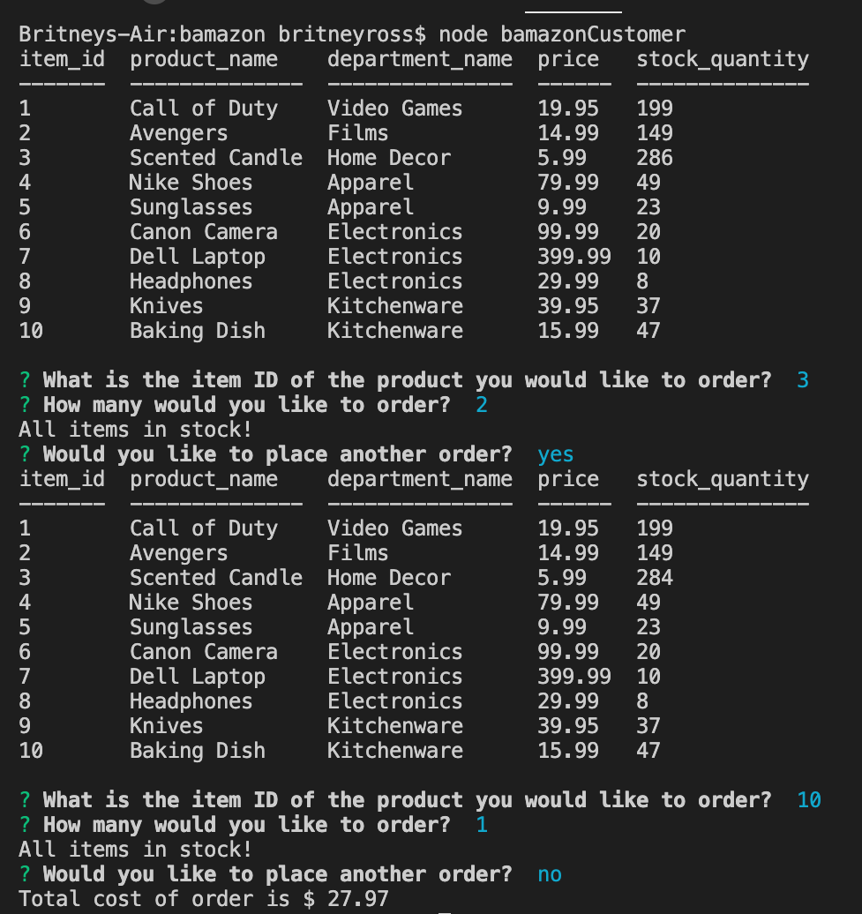

# Bamazon

## Function
To use, run node bamazonCustomer.js from the app's root directory. 
This will show all items available for purchase, the item Id, and the price. The user will be prompted to choose an item for order, the quantity, and if they would like to place another order. If the item is in stock, the purchase will go through. If the item is out of stock, the user will be notified and asked if they wish to place another order. The user will then be shown the total cost of the order.  

## Dependencies:
* inquirer
* mysql
* console.table

